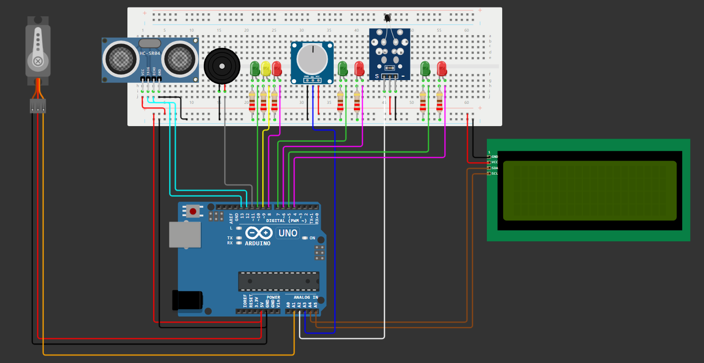

# 🌎 GS Inovação Azul

[Projeto no Wokwi](https://wokwi.com/projects/399769764705866753)

## 🤖 Edge Computing & Computer Systems

Entrega da matéria Edge Computing & Computer Systems para GS 2024.

## 👥 Integrantes

- RM: 556506 // Nicolas Caciolato Reis
- RM: 554736 // Rafael Federici de Oliveira

## 📕 Sobre o Projeto

</img>

Este projeto consiste em um sistema de monitoramento de informações sobre combutíveis limpos utilizados em embarcações marinhas, com o intuito de colher dados para minimizar os gastos de combustíveis e emissões de poluentes nos mares e atmosfera.

## 🔨 Ferramentas

- [Arduino UNO](https://docs.arduino.cc/hardware/uno-rev3/)
- [Linguagem Arduino](https://www.arduino.cc/reference/pt/)
- [C++](https://learn.microsoft.com/pt-br/cpp/?view=msvc-170)

## 🖥️ Requisitos e Componentes

Simulador: [Wokwi](https://wokwi.com/)

Componentes Utilizados:

- [Arduino UNO:](https://docs.wokwi.com/pt-BR/parts/wokwi-arduino-uno) Controlar os demais componentes.
- [LCD_I2C:](https://docs.wokwi.com/pt-BR/parts/wokwi-lcd2004) Mostrar visualmente as informações.
- [Sensor de Distância Ultrassônico HC-SR04:](https://docs.wokwi.com/pt-BR/parts/wokwi-hc-sr04) Medir a capacidade do tanque.
- [Potênciometro:](https://docs.wokwi.com/pt-BR/parts/wokwi-potentiometer) Simular medição do Ph.
- [Sensor de Temperatura NTC:](https://docs.wokwi.com/pt-BR/parts/wokwi-ntc-temperature-sensor) Medir a temperatura do combustível.
- [LEDs:](https://docs.wokwi.com/pt-BR/parts/wokwi-led) Feedback da situação do sistema.
- [Buzzer:](https://docs.wokwi.com/pt-BR/parts/wokwi-buzzer) Feedback auditivo para situações críticas.
- [Servo Motor:](https://docs.wokwi.com/pt-BR/parts/wokwi-servo) Comporta para reabastecimento.

Incluir as seguintes bibliotecas no projeto:

    #include <Wire.h>
    #include <Servo.h>
    #include <LiquidCrystal_I2C.h>

## 📒 Instruções de Uso

- Abrir o [projeto no Wokwi](#-gs-inovação-azul)
- Iniciar a simulação no botão 'Start the simulation'
- Alterar os valores nos componentes: 

    - Sensor de Distância Ultrassônico HC-SR04
    - Potênciometro
    - Sensor de Temperatura NTC

- Observar os dados apresentados no LCD_I2C